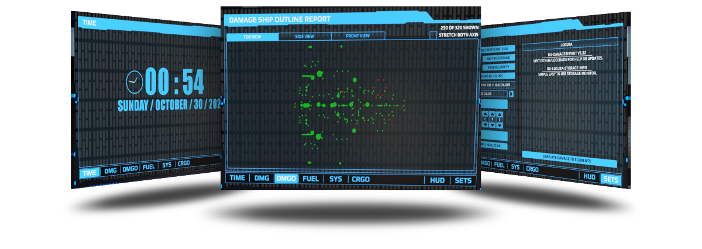

:heavy_exclamation_mark: | HTML on screens and signs is off by default. You will need to enter settings and enable them.
:---: | :---

# Information
A multi-screen capable, touch enabled, easy to install ship damage reporting script for Dual Universe. Includes a HUD mode to be mobile while repairing. Highlights damaged/broken elements in 3D space for easier finding.

---

# Preview

 

# Features
- Settings screen
- Fuel level screen (Atmo/Space/Rocket)
- Time and date screen
- Damage item screen
- Damage overview screen
- Easy find damaged items with arrows
- Change backgrounds, or dont use one
- Change all colors
- HUD mode for out of ship repairs
- Scrap tier calculations
- Runs with a single monitor, or with many
- Touchscreen enabled
- Control each monitor independently
- Will also run without a monitor using HUD mode
- Saves data to databank

# Installation / Documentation / Wiki

# Edit Code

# Screen And Sign Compatibility
:blue_square: Not Tested :green_square: Working :yellow_square: Partially Works Without Edits :red_square: Not Working Without Edits
> **Note**
> Please post in Discussions if you can confirm a screen or sign.
- :green_square: Screens
- :green_square: Modern Screens
- :green_square: Transparent Screens
- :green_square: Modern Transparent Screens
- :blue_square: Signs
- :blue_square: Vertical Signs

# Ways To Help
- Contribute new code, or updating whats already here
- Donate for Dr Pepper funds at Venmo @terranbytes
- Join or start a discussion on the discussions tab

# In Game
- CredenceH (Dual Universe)
- Locura (Dual Universe)
- NoobTheory (Dual Universe)

# Other
> **Note**
> - This was originally a fork from (https://github.com/DorianTheGrey).
> - Also Based on work by (https://github.com/paulheu).
> - Also Based on work by (https://github.com/Jericho1060).

> **Warning**
> This may or may not work with some screens or signs. Please check list above for compatibility.

> **Warning**
> Too many screen in an area will hurt game performance. The game will also start throttling back screen quality upon reaching a certain number of screens. Using Animations in screens will make this much worse. Only use a few animated screens in an area for best performance.
